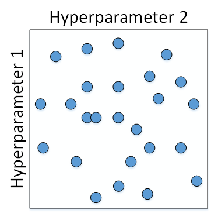
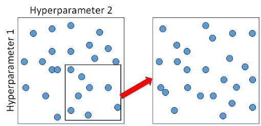
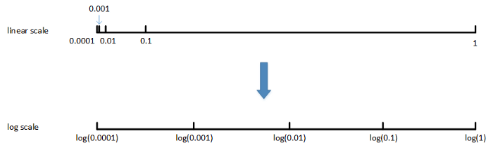
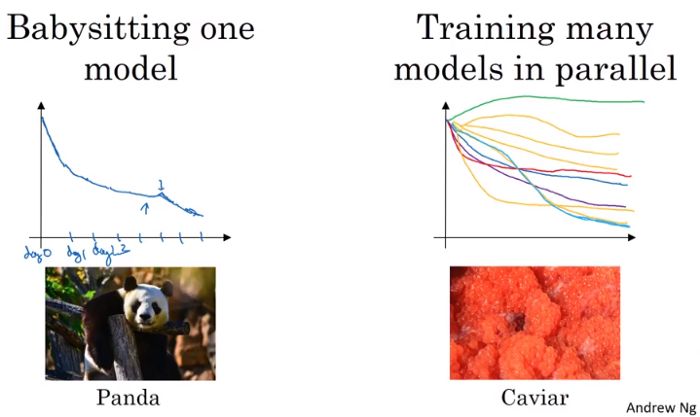

# Hyperparameter
## Parameter
可以從 training data 取得，model 透過數據<b>自動學習</b>出參數。其為預測模型的一部分。

* weight、bias

 

## Hyperparameter
訓練 model 前<b>手動設置的</b>，其值無法從數據估計得到。其為使訓練模型時表現得更出色。

* learning rate、batch size、layers、hidden units

 

### 如何找出超參數的最佳數值

1. 經驗法則 : 對於模型、資料有一定熟悉度，但是並不適用全部的情況。

2. 反覆測試 : 給定範圍值，給電腦自動調校，較耗時但是能夠得到最佳數值。

 

### Hyperparameter 調校順序
#### Random Sample

#### Machine Learning
機器學習，將每個參數等距以格子法選取任意個數的點 (圖一)。

然後，分別使用不同點對應的參數組合進行系統化訓練，最後根據驗證集上的表現好壞，來決定最佳參數。

   圖一

#### Deep Learning
深度神經網絡模型中，比較好的做法是隨機選擇 (圖二)。

原因為:
1. 我們無法預先知道那些參數對網絡有較大的影響。
2. 再者，隨機選取的方式，則可確保我們儘量測試到更多可能的參數。

 圖二

通常使用 由粗到細的採樣(coarse to fine sampling scheme)，經過隨機採樣之後，我們可能得到某些區域模型的表現較好 (圖三左)。

再對此區域做更密集的隨機採樣 (圖三右)。

 圖三

 

#### Using an appropriate scale to pick hyperparameters

#### Linear Scale
有些超參數可以進行尺度均勻採樣。

例如 : layers、hidden units，其為正整數，可進行均勻隨機採樣。

#### Log Scale
有些超參數需要非均勻隨機採樣。

例如 : η 的待調範圍是 [0.0001, 1]。假設其最佳值分布於 [0.0001, 0.1]，而 [0.1, 1] 效果差。

將 linear scale 轉換為 log scale 後，再進行均勻採樣 (圖四)。

 圖四

 

### Hyperparameters tuning in practice: Pandas vs. Caviar
經調校選擇完最佳的超參數，並不是一成不變，在一段時間之後，需要根據新數據和實際情況，再次調整超參數，以獲得當時最佳模型。

 因此，在訓練深度神經網絡時，通常會考量計算能力，進行以下兩種方式訓練模型:
1. Pandas : 專心訓練一個模型
2. Caviar : 運用大量計算，同時訓練大量的模型

 圖五

 

### Reference
> [Ray Lin (2018) "Hyperparameter tuning"](https://medium.com/%E5%AD%B8%E4%BB%A5%E5%BB%A3%E6%89%8D/hyperparameter-tuning-df25ebaa36da)