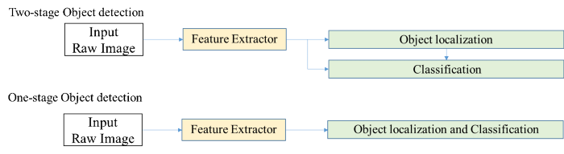
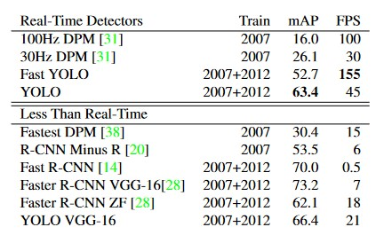
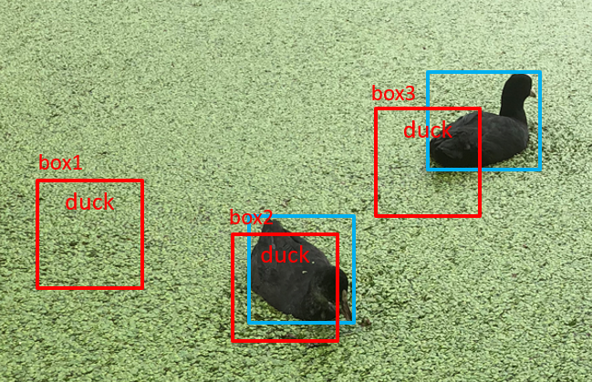
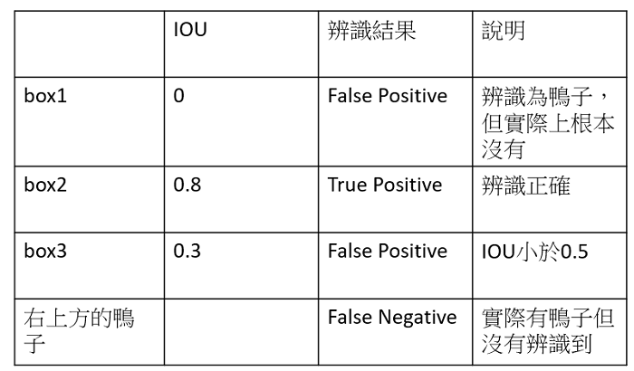

# The algorithm architecture of YOLO v1: Real Time Object Detection.

## Contents

1. [Background](#background)

 

## Background

### Object localization and classification

Object detection 運作步驟 :
1. 偵測目標位置(產生物件框)
2. 對目標物件進行分類

其演算法架構可分為 one-stage, two-stage.

* two-stage: 將步驟1, 2分開執行，輸入之影像先藉由物件偵測產生物件框後，再透過 classification 進行分類。performance 通常較好，若偵測出的物件過多，除非有很強的GPU平行運算，否則運算時間將會慢許多。

    ex. RCNN

* one-stage: 輸入之影像透過神經網路同時進行物件偵測與辨識。Single Shot Detector (SSD)，一個深度神經網路便可完成所有物件偵測。運算速度較 one-stage 快，但 performance 相對沒有很好，不過後續研究結構的複雜化使其 performance 愈來愈好甚至超越 two-stage。

    ex. YOLO

### Comparison to Other Real-Time Systems

YOLO - FPS:45, mAP:63.4

於 Real-Time Detectors 雖然每秒幀數(FPS)表現普通，不過其對所有辨識種類的平均辨識率(mAP)為最高。

於 Less Than Real-Time 其mAP表現不遜色於其他，且FPS為最高。

mAP: 系統對於所有辨識種類的平均辨識率

| predict | result |
|---|---|
|  |  |

$$ \quad precision \quad = \frac{TP} {TP+FP}

$$ \quad recall \quad = \frac{TP} {TP+FN}
