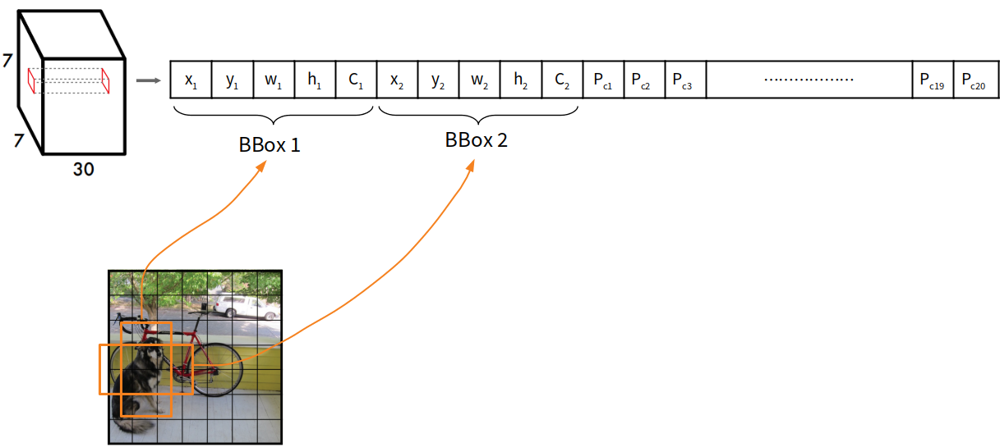

# Algorithm architecture of YOLO v1: Real Time Object Detection.

You Only Look Once: Unified, Real-Time Object Detection

 

## Table of contents

* [Introduce](#introduce)
    * [Object Detection](#Object-Detection)
    * [Object localization and classification](#Object-localization-and-classification)
    * [Comparison to Other Real-Time Systems](#Comparison-to-Other-Real-Time-Systems)
        * [mAP](#mAP-系統對於所有辨識種類的平均辨識率)
* [Algorithm architecture](#Algorithm-architecture)
    * [Unified Detection](#Unified-Detection)
        * [The Model](#the-model)
        * [Confidence](#confidence)
    * [The Architecture](#The-Architecture)
    * [Training](#training)
    * [Loss Function](#loss-function)
    * [NMS (Non-max suprresed)](#NMS-Non-max-suprresed)
* [Reference](#reference)

 

## Introduce

### Object Detection

Algorithm of The YOLO Detection System 其流程主要分為三個步驟 :
1. 將影像大小調整至448\*448
2. 執行卷積神經網路進行物件偵測與分類
3. 透過NMS (Non-max suprresed) 方式框出影像中物件之位置，輸出最終結果

### Object localization and classification

Object detection 運作步驟 :
1. 偵測目標位置(產生物件框)
2. 對目標物件進行分類

其演算法架構可分為 one-stage, two-stage.

* two-stage: 將步驟1, 2分開執行，輸入之影像先藉由物件偵測產生物件框後，再透過 classification 進行分類。performance 通常較好，若偵測出的物件過多，除非有很強的GPU平行運算，否則運算時間將會慢許多。

    ex. RCNN

* one-stage: 輸入之影像透過神經網路同時進行物件偵測與辨識。Single Shot Detector (SSD)，一個深度神經網路便可完成所有物件偵測。運算速度較 two-stage 快，但 performance 相對沒有很好，不過後續研究結構的複雜化使其 performance 愈來愈好甚至超越 two-stage。

    ex. YOLO

### Comparison to Other Real-Time Systems

YOLO - FPS: 45, mAP: 63.4

於 Real-Time Detectors 雖然每秒幀數(FPS)表現普通，不過其對所有辨識種類的平均辨識率(mAP)為最高。

於 Less Than Real-Time 其mAP表現不遜色於其他，且FPS為最高。

| Comparison                    | Error Analysis                   |
| :---------------------------: | :------------------------------: |
|  |  |

#### mAP: 系統對於所有辨識種類的平均辨識率。

IOU = 交集a / 聯集a，其值介於0~1之間。

一般判斷辨識率以IOU >= 0.5 為基準。

| bounding box            | IOU                    |
| :---------------------: | :--------------------: |
|  |  |

precision: 所有被系統預測為鴨子的結果中，真的是鴨子的比例。

recall: 所有真的鴨子，被系統預測正確的比例。

| predict                      | result                    |
| :--------------------------: | :-----------------------: |
|    |  |
| <b>precision</b>             | <b>recall</b>             |
|  |  |

AP (average precision): 系統預測該類別時(鴨子)的平均辨識率。

mAP (mean average precision): 系統對於所有辨識種類(鴨子、貓、狗、人、車...等等)的平均辨識率。

 

## Algorithm architecture

### Unified Detection

#### The Model

YOLO會將影像分成S\*S格(grid)，每個grid 有兩個bounding box 做物件偵測，其一開始偵測到的物件有7\*7\*2 = 98個，接著每個grid 會辨識該物件框所框出之物件所屬的類別，最後採用NMS將多餘的bounding box 濾除。

其最後輸出tensor 的維度 : S \* S \* (B \* 5 \+ C)

* S : 網格數量
* B : 每個grid 預測物件的bounding box 數 (YOLO v1 set B=2)
* 5 : 物件中心 (x, y)、寬高 (w, h)、confidence(是否為物件)
* C : 類別數量(兩個bounding box 的類別機率)

#### Confidence

Grid cell 包含目標的機率與IOU相乘。

Pr(Object) -> bounding box 裡可能是物件的probabilities

Pr(Class | Object) -> 偵測為物件後，該物件所屬類別的probabilities

### The Architecture

輸入尺寸調整至448\*448，以增加提取解析度。

神經網路參考GoogleNet。使用1\*1卷積(降維)對3\*3卷積核運算做壓縮，以減少計算參數。

最後輸出tensor 為 7 \* 7 \*(2 \* 5 \+ 20) = 7 \* 7 \* 30

Bounding box 四個位置值為正規化數值 :

(x, y, w, h) = bbox(x, y, w, h) / 原影像(x, y, w, h)

C = 20，使用PASCAL VOC 資料集，有20種類別。

Activation function 採用Leaky ReLU :

ReLU會使部分神經元輸出為0，以解決Overfitting，但神經元停止後，就難以激活(Dead ReLU Problem)，因此採用Leaky ReLU 不增加計算複雜度，提升模型的學習能力。

`f(x) = max(0.01x, x)`

### Training

### Loss Function

### NMS (Non-max suprresed)

 

## Reference
* [You Only Look Once: Unified, Real-Time Object Detection](https://arxiv.org/pdf/1506.02640.pdf)
* [深度學習: 物件偵測上的模型結構變化](https://chih-sheng-huang821.medium.com/%E6%B7%B1%E5%BA%A6%E5%AD%B8%E7%BF%92-%E7%89%A9%E4%BB%B6%E5%81%B5%E6%B8%AC%E4%B8%8A%E7%9A%84%E6%A8%A1%E5%9E%8B%E7%B5%90%E6%A7%8B%E8%AE%8A%E5%8C%96-e23fd928ee59)
* [影像辨識常見的IOU、AP、mAP是什麼意思?](http://yy-programer.blogspot.com/2020/06/iouapmap.html)
* [YOLO v1 物件偵測~論文整理](https://medium.com/%E7%A8%8B%E5%BC%8F%E5%B7%A5%E4%BD%9C%E7%B4%A1/yolo-v1-%E7%89%A9%E4%BB%B6%E5%81%B5%E6%B8%AC-%E8%AB%96%E6%96%87%E6%95%B4%E7%90%86-935bfd51d5e0)
* [深度學習YOLO V1 深刻解讀YOLO V1(圖解)](https://blog.csdn.net/c20081052/article/details/80236015)
* [物件偵測 S4: YOLO v1 簡介](https://yuweichiu.github.io/%E4%BA%BA%E5%AD%B8%E6%A9%9F%E5%99%A8%E5%AD%B8%E7%BF%92/p0005-Object-Detection-S4-YOLO-v1/)
* [圖解一階段物件偵測算法_Part01 - YOLOv1](https://www.youtube.com/watch?v=sq_OfIhb5Oc)