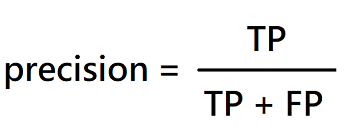

# The algorithm architecture of YOLO v1: Real Time Object Detection.

You Only Look Once:

Unified, Real-Time Object Detection

## Table of contents

1. [Background](#background)

 

## Background

### Object localization and classification

Object detection 運作步驟 :
1. 偵測目標位置(產生物件框)
2. 對目標物件進行分類

其演算法架構可分為 one-stage, two-stage.

* two-stage: 將步驟1, 2分開執行，輸入之影像先藉由物件偵測產生物件框後，再透過 classification 進行分類。performance 通常較好，若偵測出的物件過多，除非有很強的GPU平行運算，否則運算時間將會慢許多。

    ex. RCNN

* one-stage: 輸入之影像透過神經網路同時進行物件偵測與辨識。Single Shot Detector (SSD)，一個深度神經網路便可完成所有物件偵測。運算速度較 one-stage 快，但 performance 相對沒有很好，不過後續研究結構的複雜化使其 performance 愈來愈好甚至超越 two-stage。

    ex. YOLO

### Comparison to Other Real-Time Systems

YOLO - FPS:45, mAP:63.4

於 Real-Time Detectors 雖然每秒幀數(FPS)表現普通，不過其對所有辨識種類的平均辨識率(mAP)為最高。

於 Less Than Real-Time 其mAP表現不遜色於其他，且FPS為最高。

#### mAP: 系統對於所有辨識種類的平均辨識率。

IOU = 交集a/聯集a，其值介於0~1之間。

一般判斷辨識率以IOU >= 0.5 為基準。

| bounding box | IOU |
|---|---|
|  |  |

precision: 所有被系統預測為鴨子的結果中，真的是鴨子的比例。

recall: 所有真的鴨子，被系統預測正確的比例。

| predict | result |
|---|---|
|  |  |

| precision | recall |
|---|---|
|  |  |

AP (average precision): 系統預測該類別時(鴨子)的平均辨識率。

mAP (mean average precision): 系統對於所有辨識種類(鴨子、貓、狗、人、車...等等)的平均辨識率。

 

## Reference
* [You Only Look Once:Unified, Real-Time Object Detection](https://arxiv.org/pdf/1506.02640.pdf)
* [深度學習: 物件偵測上的模型結構變化](https://chih-sheng-huang821.medium.com/%E6%B7%B1%E5%BA%A6%E5%AD%B8%E7%BF%92-%E7%89%A9%E4%BB%B6%E5%81%B5%E6%B8%AC%E4%B8%8A%E7%9A%84%E6%A8%A1%E5%9E%8B%E7%B5%90%E6%A7%8B%E8%AE%8A%E5%8C%96-e23fd928ee59)
* [影像辨識常見的IOU、AP、mAP是什麼意思?](http://yy-programer.blogspot.com/2020/06/iouapmap.html)
